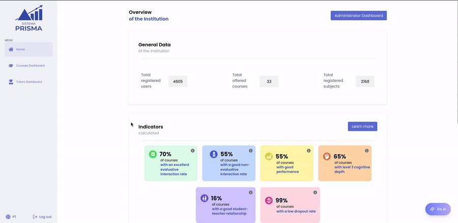

<p align="center">
  
</p>

<p align="center">
  Uma interface web para apoiar o acompanhamento acadêmico por meio de indicadores, rankings, dashboards e visualizações educacionais.
</p>

<p align="center">
  
  <a href="./LICENSE"></a>
  
  
  
</p>

<h4 align="center">
  <a href="#sobre-o-prisma">Sobre</a> |
  <a href="#por-que-o-projeto-existe">Motivação</a> |
  <a href="#integração-com-o-moodle">Moodle</a> |
  <a href="#o-que-a-interface-oferece">Recursos</a> |
  <a href="#visão-da-interface">Interface</a> |
  <a href="#executando-localmente">Executando</a>
</h4>

📝 **Disponível em outros idiomas:** [English](./README.md)

# Prisma Frontend

O **Prisma Frontend** é a camada de interface do projeto Prisma, uma plataforma voltada para o acompanhamento de disciplinas, estudantes e tutores em contextos educacionais.

A proposta do projeto é transformar dados acadêmicos em uma experiência visual mais clara para apoiar análises de desempenho, risco, participação e acompanhamento pedagógico. Em vez de apresentar apenas tabelas isoladas ou relatórios estáticos, o Prisma organiza indicadores, rankings e gráficos em painéis navegáveis, permitindo que diferentes perfis de usuário encontrem rapidamente sinais relevantes sobre a trajetória acadêmica dos estudantes.

O Prisma hoje inclui uma solução voltada à integração com o Moodle, permitindo que dados do ambiente virtual de aprendizagem apoiem os indicadores e visualizações de acompanhamento acadêmico do projeto.

Este repositório contém a aplicação web. A API, autenticação e regras de acesso ficam no backend:

- Backend: [tarrafa-ufjf/Prisma-backend](https://github.com/tarrafa-ufjf/Prisma-backend)

## Demonstração

<p align="center">
  
</p>

## Sobre o Prisma

O Prisma nasce da necessidade de acompanhar grandes volumes de informações acadêmicas de forma mais acessível. Em ambientes educacionais, dados sobre disciplinas, atividades, estudantes, tutores e desempenho costumam existir em sistemas diferentes ou aparecer de maneira pouco amigável para tomada de decisão.

A interface busca reduzir essa distância entre dado e interpretação. Ela centraliza informações importantes e apresenta visualizações que ajudam a perceber padrões, comparar cenários e identificar pontos que merecem atenção.

O foco não é substituir a análise humana, mas ampliar sua capacidade: oferecer uma visão mais organizada para que coordenadores, professores, tutores e equipes de acompanhamento possam investigar situações acadêmicas com mais contexto.

## Por que o projeto existe

O acompanhamento acadêmico depende de perguntas que nem sempre são simples de responder olhando dados brutos:

- Quais disciplinas concentram maiores sinais de dificuldade?
- Quais estudantes podem precisar de acompanhamento mais próximo?
- Como indicadores de participação, desempenho e evasão se distribuem entre disciplinas?
- Quais tutores, turmas ou componentes apresentam resultados mais destacados?
- Onde há padrões que merecem uma investigação pedagógica mais cuidadosa?

O Prisma organiza essas perguntas em uma experiência visual. Rankings, gráficos, indicadores e filtros ajudam a transformar dados dispersos em pistas interpretáveis.

## Integração com o Moodle

O Prisma foi pensado para trabalhar com dados do Moodle, conectando informações do ambiente virtual de aprendizagem aos fluxos de acompanhamento acadêmico. Essa integração ajuda a transformar registros sobre disciplinas, estudantes, tutores, atividades e acessos em indicadores, rankings, dashboards e painéis individuais.

Administradores podem acessar telas de configuração do Moodle, cadastrar a conexão utilizada pelo sistema e verificar se a integração está pronta. Depois de configurado, o Moodle passa a ser uma das fontes acadêmicas que alimentam a experiência do Prisma.

O Prisma foi pensado para funcionar em diferentes versões do Moodle. A tabela abaixo lista as versões já testadas com o projeto:

| Versão do Moodle | Status | Observações |
| --- | --- | --- |
| 3.1.3 | Testada | Versão atualmente validada para o fluxo de integração. |

## Para quem é

O projeto foi pensado para pessoas envolvidas no acompanhamento e gestão acadêmica:

- **Coordenadores e gestores**, que precisam observar o panorama de disciplinas.
- **Professores e tutores**, que acompanham turmas, atividades e estudantes.
- **Equipes pedagógicas**, que investigam risco, participação e desempenho.
- **Pesquisadores**, que analisam dados educacionais e indicadores de aprendizagem.
- **Administradores**, que precisam manter recursos e informações de apoio ao sistema.

## O que a interface oferece

O Prisma Frontend reúne telas e componentes para explorar diferentes níveis de informação acadêmica:

- **Página inicial com indicadores gerais**, rankings e visões agregadas.
- **Seleção e acompanhamento de disciplinas**, com filtros e dados associados para navegar por contextos específicos.
- **Painéis de estudantes**, com dados pessoais, indicadores e gráficos de atividades.
- **Painéis de tutores**, com dados gerais, rankings e indicadores relacionados.
- **Gestão da integração com o Moodle**, com telas administrativas para cadastrar e validar a conexão.
- **Área administrativa**, voltada a recursos de gestão do sistema.
- **Chatbot com suporte a visualizações Vega**, permitindo explorar respostas e gráficos.
- **Internacionalização**, com suporte a português brasileiro e inglês.

## Visão da interface

A navegação do Prisma foi organizada para ir do panorama geral ao detalhe:

| Área | Papel na experiência |
| --- | --- |
| Home | Apresenta uma visão geral do ambiente acadêmico, com indicadores e rankings. |
| Disciplinas | Permite selecionar uma disciplina, acompanhar seus dados principais e usar filtros para exploração. |
| Alunos | Mostra listas e páginas individuais de estudantes. |
| Tutores | Exibe dados, indicadores e rankings relacionados a tutoria. |
| Chatbot | Apoia consultas e visualizações geradas a partir de dados. |
| Administrador | Agrupa telas de gestão, integração com o Moodle e manutenção do sistema. |

## Como o Prisma interpreta dados

O projeto combina diferentes formas de visualização para apoiar leituras complementares:

- **Indicadores** destacam sinais sintéticos, como desempenho, risco ou engajamento.
- **Rankings** ajudam a comparar disciplinas, estudantes ou tutores.
- **Gráficos** mostram distribuições, evoluções e relações entre variáveis.
- **Tabelas e filtros** permitem investigação mais direta e granular.
- **Painéis individuais** conectam informações gerais a trajetórias específicas.

Esses recursos foram pensados para favorecer uma leitura progressiva: primeiro o usuário identifica um sinal relevante, depois aprofunda a análise em telas mais específicas.

## Relação com o backend

Este frontend depende do Prisma Backend para obter dados, validar sessões e manter a integração com as fontes acadêmicas utilizadas pelo projeto, incluindo o Moodle.

Em linhas gerais:

- O frontend apresenta e organiza a experiência de uso.
- O backend fornece os dados, autenticação e regras de acesso.
- A comunicação entre os dois acontece por meio da URL configurada em `NEXT_PUBLIC_API_BASE_URL`.

Para uma execução completa do projeto, os dois repositórios devem estar configurados.

## Tecnologias principais

O projeto utiliza Next.js, React, TypeScript, Tailwind CSS, Material UI, next-intl, Axios e bibliotecas de visualização como Nivo, Vega, Vega-Lite, AG Charts e MUI X Charts.

## Executando localmente

Antes de iniciar, tenha o backend configurado e em execução. Depois, no repositório do frontend:

```bash
npm install
cp .env.example .env
npm run dev
```

Configure a URL da API no arquivo `.env`:

```env
NEXT_PUBLIC_API_BASE_URL="http://localhost:8000"
```

A aplicação fica disponível em:

```text
http://localhost:3000
```

## Scripts disponíveis

| Script | Descrição |
| --- | --- |
| `npm run dev` | Inicia o ambiente de desenvolvimento com Turbopack. |
| `npm run build` | Gera a versão de produção. |
| `npm run start` | Executa a aplicação após o build. |
| `npm run lint` | Executa as verificações de lint configuradas. |

## Estrutura do repositório

```text
src/
  app/                 Rotas da aplicação com App Router
  components/          Componentes de páginas, interface e templates
  hooks/               Hooks reutilizáveis
  i18n/                Configuração de internacionalização
  types/               Tipos TypeScript
  utils/               Cliente de API, serviços e funções auxiliares
messages/              Arquivos de tradução
docs/                  Documentação e imagens de apoio
```

## Internacionalização

A interface oferece suporte a:

- `en`: idioma padrão, com URLs sem prefixo.
- `pt-BR`: português brasileiro, com prefixo `/pt-BR`.

Ao adicionar novos textos na interface, atualize:

- `messages/en.json`
- `messages/pt-BR.json`

Mais detalhes estão em [docs/internacionalizacao.md](docs/internacionalizacao.md).

## Status do projeto

O Prisma Frontend está em desenvolvimento como parte de uma iniciativa acadêmica de monitoramento educacional. A interface ainda pode evoluir em organização visual, cobertura de indicadores, experiência de uso e integração com novas fontes de dados.

## Licença

Este projeto está licenciado sob a licença MIT. Veja [LICENSE](./LICENSE).
