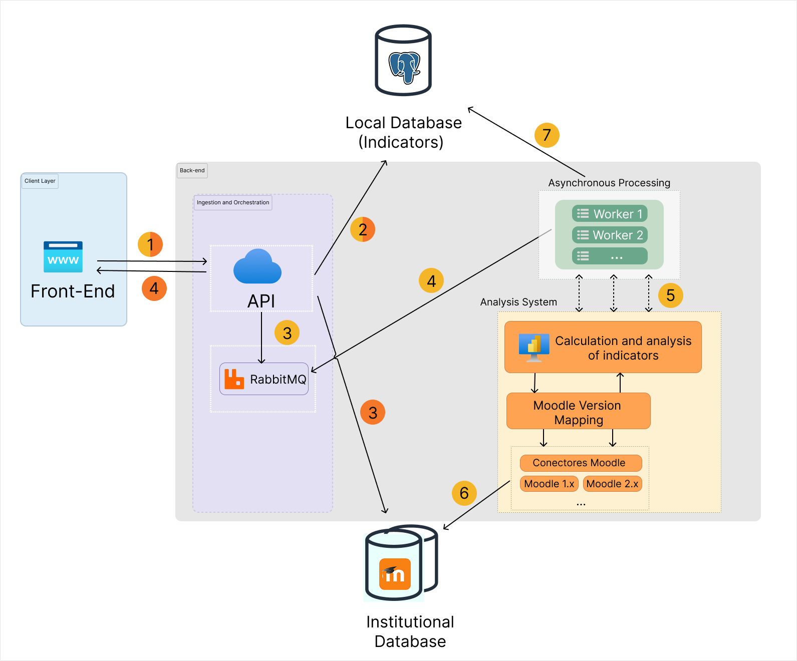

<p align="center">
  
</p>

<p align="center">
  Technical documentation for maintaining, configuring and extending Prisma.
</p>

<p align="center">
  
  
  
</p>

<h4 align="center">
  <a href="#about-this-documentation">About</a> |
  <a href="#system-architecture">Architecture</a> |
  <a href="#moodle-integration">Moodle</a> |
  <a href="#metrics-and-indicators">Metrics</a> |
  <a href="#maintenance">Maintenance</a> |
  <a href="#additional-materials">Materials</a>
</h4>

📝 **Available in other languages:** [Português (Brasil)](TECHNICAL_DOCUMENTATION.pt-BR.md)

# Prisma - Technical Documentation

This document contains technical information for the maintenance, configuration and evolution of the Prisma project.

It complements the main [README](README.md), which provides an overview of the project, its objectives, features and instructions for running the application locally.

The documentation is intended primarily for developers, researchers and future contributors who need to understand how the system works or perform modifications to the project.

## About this documentation

The Prisma project involves multiple technical components, including the frontend, backend and integration with Moodle.

This document centralizes information that is more specific to development and maintenance, such as:

- System architecture and component relationships.
- Moodle integration requirements.
- Procedures for updating Moodle versions.
- Metrics and indicators used by the system.
- Maintenance and extension guidelines.
- Technical decisions and relevant implementation details.

The goal is to make the project easier to maintain and facilitate the continuity of development by future contributors.

## System architecture

Prisma is composed of different components that work together to receive academic data, process it asynchronously, calculate indicators and make the resulting information available through the web interface.

<p align="center">
  
</p>

### Main components

#### Client layer

The **Client Layer** contains the web interface through which users interact with Prisma.

- **Front-End:** Web application responsible for presenting dashboards, indicators, rankings, graphs and other visualizations to users.

#### Backend

The backend is responsible for handling requests, orchestrating data processing and coordinating communication between the different components of the system.

##### Ingestion and orchestration

- **API:** Central entry point for requests from the Front-End. It manages communication with the other system components and provides access to the application's services.
- **RabbitMQ:** Message broker responsible for queuing tasks and supporting asynchronous processing.

##### Asynchronous processing

- **Workers:** Background processes that consume tasks from RabbitMQ and coordinate the execution of data processing and analysis operations.

##### Analysis system

The **Analysis System** is responsible for processing the data required to generate the project's indicators.

Its main components include:

- **Calculation and analysis of indicators:** Module responsible for calculating and analyzing the indicators used by Prisma.
- **Moodle Version Mapping:** Component responsible for adapting communication and data access according to the Moodle version being used.
- **Moodle Connectors:** Version-specific connectors responsible for communicating with the corresponding Moodle installations.

#### Databases

Prisma interacts with two main data sources:

- **Local Database (Indicators):** Local PostgreSQL database responsible for storing the indicators and processed results generated by the system.
- **Institutional Database:** External institutional database containing the original academic data, including data provided by Moodle.

### Data flow

The architecture follows an asynchronous processing flow, represented by steps 1 through 7 in the architecture diagram:

1. **Front-End request:** The Front-End sends a request to the API to initiate an operation or request information.

2. **Local data access:** The API can query the Local Database to retrieve previously calculated indicators and other stored information.

3. **Task orchestration:** The API sends processing tasks to RabbitMQ and communicates with the Institutional Database when access to source data is required.

4. **Asynchronous execution:** Workers consume tasks from RabbitMQ and execute the required processing operations. Meanwhile, the API can return the initial response to the Front-End.

5. **Analysis coordination:** Workers communicate with the Analysis System to coordinate the calculation and analysis of indicators.

6. **Moodle data extraction:** The Analysis System uses the Moodle Version Mapping and the appropriate Moodle Connector to retrieve the required data from the Institutional Database.

7. **Result persistence:** After the calculations and analyses are completed, the processing components store the resulting indicators in the Local Database.

This architecture separates user interaction, data ingestion, asynchronous processing and indicator calculation, allowing potentially time-consuming operations to be executed in the background while keeping the web interface responsive.

## Moodle integration

Prisma uses Moodle as an institutional academic data source.

The integration is designed to support different Moodle versions through version-specific connectors and a mapping layer responsible for adapting communication according to the Moodle version being used.

### Moodle version mapping

The **Moodle Version Mapping** component determines which connector and communication strategy should be used for a given Moodle version.

This approach allows the analysis system to maintain a common processing flow while isolating version-specific differences in the connectors.

### Moodle connectors

Each supported Moodle version may require a specific connector.

Connectors are responsible for:

- Establishing communication with Moodle.
- Retrieving the required academic data.
- Handling version-specific differences.
- Providing data to the Analysis System in the expected format.

### Supported Moodle versions

The following versions have been tested with the current integration:

| Moodle version | Status | Notes |
| --- | --- | --- |
| 3.1.3 | Tested | Current validated version for the integration flow. |

> This table should be updated whenever a new Moodle version is tested and validated.

Any version-specific changes or compatibility issues should be documented here to facilitate future migrations.

## Data processing

Prisma uses asynchronous processing to execute operations that may require significant processing time.

The general processing sequence is:

```text
Front-End
    │
    ▼
   API
    │
    ▼
RabbitMQ
    │
    ▼
 Workers
    │
    ▼
Analysis System
    │
    ├── Moodle Version Mapping
    │
    └── Moodle Connector
             │
             ▼
   Institutional Database
             │
             ▼
    Indicator Calculation
             │
             ▼
      Local Database

```

This architecture allows long-running operations to be handled by background workers instead of blocking the user-facing application.

### Asynchronous processing

RabbitMQ acts as the communication layer between the API and the workers.

The API creates processing tasks and places them in the message queue. Workers consume these tasks and execute the required operations.

This separation allows multiple processing tasks to be handled independently and provides a mechanism for scaling background operations.

## Metrics and indicators

Prisma uses metrics and derived indicators to transform Moodle data into information for academic monitoring and analysis.

The indicators are organized into two groups:

- **Student indicators:** Engagement, Motivation, Performance, Student-Instructor Interaction, Cognitive Depth and Dropout Risk.
- **Teacher/Tutor indicators:** Access, Forum Replies and Feedback.

The calculation process generally consists of four stages:

1. **Data extraction:** raw data are retrieved from the Moodle database.
2. **Metric calculation:** raw Moodle records are transformed into quantitative metrics.
3. **Discretization and aggregation:** metrics may be categorized and aggregated at student, tutor, course or institutional level.
4. **Persistence and visualization:** the resulting indicators are stored and made available to the Front-End.

> The calculations described below represent the indicator methodology implemented in Prisma. Implementation details may vary according to the Moodle version and the corresponding connector.

### Student indicators

Student indicators are calculated from Moodle activity and academic data. The main dimensions considered are engagement, motivation, performance, student-instructor interaction, cognitive depth and dropout risk.

| Indicator | Moodle source | Raw metric |
| --- | --- | --- |
| **Engagement** | `mdl_forum_posts` | Total number of posts made by the student in evaluative forums. |
| **Motivation** | `mdl_forum_posts` | Total number of posts made by the student in non-evaluative forums. |
| **Performance** | `mdl_grade_grades` | Composite score based on absolute grade and relative position in the course grade distribution. |
| **Student-Instructor Interaction** | `mdl_forum_posts`, `mdl_messages` | Frequency of direct message exchanges and forum replies between students and tutors. |
| **Cognitive Depth** | `mdl_logstore_standard_log` | Interaction score based on the complexity of the student's activity within Moodle. |
| **Dropout Risk** | `mdl_user_lastaccess`, `mdl_logstore_*` | Risk classification based on inactivity and low performance, engagement, motivation and cognitive depth. |

### Student indicator discretization

Student metrics are categorized relative to the distribution observed within the course.

The classification uses the first quartile ($Q1$), third quartile ($Q3$), and interquartile range:

```text
IQR = Q3 - Q1
LowerBound = Q1 - 1.5 × IQR
UpperBound = Q3 + 1.5 × IQR
```

The resulting categories are:

| Category | Relative position |
| --- | --- |
| **Very low** | Below the lower bound |
| **Low** | Between the lower bound and Q1 |
| **Average** | Between Q1 and Q3 |
| **High** | Between Q3 and the upper bound |
| **Very high** | Above the upper bound |

This relative classification allows student results to be interpreted according to the characteristics of their own course cohort rather than only through absolute values.

### Engagement

**Purpose:**  
Measures student participation in evaluative forums.

**Data source:**

- `mdl_forum_posts`

**Calculation:**  
The number of posts made by each student in forums associated with evaluated activities is counted.

**Interpretation:**  
Higher values indicate greater participation in formal discussion activities.

**Discretization:**  
The resulting value is classified into five levels using the student discretization procedure described above.

---

### Motivation

**Purpose:**  
Measures voluntary or non-assessed participation in Moodle discussion spaces.

**Data source:**

- `mdl_forum_posts`

**Calculation:**  
The number of posts made by each student in non-evaluative forums is counted.

**Interpretation:**  
Higher values indicate greater participation in interaction spaces that are not directly associated with formal assessment.

**Discretization:**  
The resulting value is classified into five relative levels.

---

### Performance

**Purpose:**  
Represents student academic performance while considering both absolute achievement and the student's position relative to the course cohort.

**Data source:**

- `mdl_grade_grades`

**Calculation:**  
The performance indicator combines:

1. The student's absolute grade.
2. The student's relative position in the course grade distribution.

The final score is calculated as the arithmetic mean of these two components.

**Interpretation:**  
The indicator considers both the student's obtained grade and their performance relative to other students in the same course.

**Categories:**

| Category | Absolute grade | Relative position |
| --- | --- | --- |
| **Very low** | Below 39% | Below the lower bound |
| **Low** | 40–59% | Between the lower bound and Q1 |
| **Average** | 60–79% | Between Q1 and Q3 |
| **Good** | 80–89% | Between Q3 and the upper bound |
| **Very good** | Above 90% | Above the upper bound |

---

### Student-Instructor Interaction

**Purpose:**  
Measures interaction between students and instructors/tutors.

**Data sources:**

- `mdl_forum_posts`
- `mdl_messages`

**Calculation:**  
The indicator considers the frequency of direct message exchanges and forum interactions between students and tutors.

**Interpretation:**  
Higher values indicate greater interaction between the student and the instructional staff.

**Discretization:**  
The resulting metric is classified into five relative levels.

---

### Cognitive Depth

**Purpose:**  
Estimates the depth of student engagement based on observable interaction traces in Moodle.

**Data source:**

- `mdl_logstore_standard_log`

**Activity types considered:**

- `assign`
- `quiz`
- `forum`

**Calculation:**  
Moodle events are organized into levels representing increasing degrees of interaction with an activity.

The general progression considers:

1. **View:** the student accesses the activity.
2. **Action:** the student performs an active task, such as submitting an assignment or posting in a forum.
3. **Revision/follow-up:** the student returns to the activity, such as viewing feedback or reviewing a quiz attempt.

For each student-activity pair, the highest interaction level reached is identified. This value is normalized according to the observable depth available for the specific Moodle activity.

The resulting achievement ratio is transformed into a continuous scale ranging from **-1 to 1**:

- Lower values indicate more superficial interaction.
- Higher values indicate deeper interaction.

The final student score is calculated as the mean across the analyzed `assign`, `quiz` and `forum` activities.

**Discretization:**  
The final score is classified into five relative levels.

---

### Dropout Risk

**Purpose:**  
Identifies students who may require closer monitoring or pedagogical intervention.

**Data sources:**

- `mdl_user_lastaccess`
- `mdl_logstore_*`

**Calculation:**  
A student is classified as being at risk when they simultaneously present **low or very low levels** in the four primary student indicators:

- Engagement
- Motivation
- Cognitive Depth
- Performance

The simultaneous presence of these conditions is used as a signaling mechanism for potential dropout risk.

**Interpretation:**  
The indicator is intended as a monitoring signal and does not represent a definitive prediction of dropout.

---

### Course-level student aggregation

Student indicators can be aggregated to produce a global representation of each course.

For most indicators, the course-level value is obtained from the arithmetic mean of the corresponding student values.

The following course-level metrics are calculated:

- Average engagement.
- Average motivation.
- Average performance.
- Average cognitive depth.
- Average student-instructor interaction.

For **Dropout Risk**, the course-level metric is the proportion of students classified as being at risk.

Course-level results can subsequently be classified relative to the distribution of courses within the institution using the same five categories:

- `very_low`
- `low`
- `average`
- `high`
- `very_high`

---

## Teacher and tutor indicators

Teacher/tutor indicators represent instructional activity within Moodle. Three dimensions are considered:

- **Access**
- **Forum Replies**
- **Feedback**

| Indicator | Moodle source | Raw metrics |
| --- | --- | --- |
| **Access** | `mdl_logstore_standard_log` | Number of unique access days, total logins, course accesses, weekly login frequency and maximum inactivity period. |
| **Forum Replies** | `mdl_forum_posts` | Number of replies, response time and response-time distribution. |
| **Feedback** | `mdl_assign_grades`, `mdl_feedback` | Number of graded assignments, assignments with feedback, feedback proportion and feedback formats. |

### Teacher/tutor temporal analysis window

Tutor indicators are calculated only within the period in which the course was effectively active in Moodle.

The analysis window is represented as:

```text
[t0, t1]
```

The window is determined from the course's daily event series. The procedure identifies periods of consistent activity while avoiding isolated accesses after course completion.

The process considers:

1. The volume of events observed over time.
2. A minimum activity criterion.
3. Contiguous periods of regular activity.
4. Small gaps caused by weekends, holidays or brief interruptions.

The period with the highest concentration of activity is selected as the primary academic window.

Only interactions recorded within this interval are considered for tutor indicators.

### Teacher/tutor discretization

Tutor metrics are discretized into five relative categories:

- **Very low**
- **Low**
- **Average**
- **High**
- **Very high**

Unlike student indicators, tutor metrics use percentiles rather than the IQR-based approach.

The thresholds are:

| Category | Range |
| --- | --- |
| **Very low** | Up to P20 |
| **Low** | P20–P40 |
| **Average** | P40–P60 |
| **High** | P60–P80 |
| **Very high** | Above P80 |

For metrics where lower values represent better performance, such as response time and inactivity period, the labels are inverted.

The resulting categories are converted to numerical values from `0` to `4` and aggregated to obtain composite tutor scores.

---

### Access

**Purpose:**  
Measures tutor presence and regularity within Moodle during the course's active period.

**Data source:**

- `mdl_logstore_standard_log`

**Raw metrics:**

- Total number of logins.
- Total number of accesses to the course.
- Average weekly login frequency.
- Maximum inactivity interval.

**Weekly login frequency:**

```text
n_login_weekly = n_login / weeks
```

where:

```text
weeks = max(((last_login - first_login) + 1) / 7, 1)
```

**Maximum inactivity:**

The longest period without recorded activity is calculated considering:

- The period between the beginning of the analysis window and the tutor's first active day.
- The period between the tutor's last active day and the end of the analysis window.
- Gaps between consecutive active days.

**Interpretation:**

Higher access frequency and shorter inactivity periods indicate greater presence and continuity within Moodle.

---

### Forum Replies

**Purpose:**  
Measures tutor responsiveness to student-initiated forum discussions.

**Data source:**

- `mdl_forum_posts`

**Calculation:**  
For each student-initiated post, the timestamp of the student's post and the timestamp of the tutor's first reply are identified.

Response time is calculated in hours:

```text
response_time = (reply_timestamp - post_timestamp) / 3600
```

Responses are grouped into three categories:

| Category | Response time |
|---|---|
| **Fast** | ≤ 24 hours |
| **Normal** | > 24 and ≤ 120 hours |
| **Late** | > 120 hours |

A weighted responsiveness score is also calculated:

```text
score =
(3 × fast + 2 × normal + 1 × late) / total_replies
```

When no replies are recorded, the temporal components are assigned a value of zero.

**Interpretation:**  
Higher scores indicate a greater volume of replies and/or faster responses.

---

### Feedback

**Purpose:**  
Measures tutor activity in assessment and the provision of feedback to students.

**Data sources:**

- `mdl_assign_grades`
- `mdl_feedback`

**Metrics:**

- Number of graded assignments.
- Number of graded assignments with feedback.
- Percentage of graded assignments with feedback.
- Amount of textual feedback.
- Amount of file-based feedback.

The feedback proportion is calculated as:

```text
feedback_proportion =
(feedback_assignments / graded_assignments) × 100
```

**Interpretation:**

The indicator considers both the volume of grading and the consistency and format of feedback provided to students.

---

## Tutor-level normalization and composite scores

Tutor metrics have different scales and characteristics. To make them comparable, metrics are normalized using the distribution of tutors from the same institution and Moodle database version.

The 5th and 95th percentiles are used as limits to reduce the influence of extreme values.

The normalized value is calculated as:

```text
x_norm =
(clip(x, P5, P95) - P5) /
(P95 - P5)
```

For metrics where lower values represent better performance, the normalized value is inverted:

```text
x_norm_inv = 1 - x_norm
```

This produces a common interpretation in which higher values represent greater presence, activity or responsiveness.

### Forum Replies Score

The tutor-level Forum Replies score combines:

- Total number of replies.
- Mean response time.
- Median response time.

```text
score_forum =
(replies_norm +
 mean_time_norm_inv +
 median_time_norm_inv) / 3
```

### Access Score

The tutor-level Access score combines:

- General Moodle access.
- Course-specific access.
- Maximum inactivity period.

```text
score_access =
(general_access_norm +
 course_access_norm +
 inactivity_norm_inv) / 3
```

### Feedback Score

The tutor-level Feedback score combines:

- Number of graded assignments.
- Number of assignments with feedback.
- Feedback proportion.
- Textual feedback.
- File-based feedback.

```text
score_feedback =
(corrections_norm +
 corrections_with_feedback_norm +
 feedback_proportion +
 textual_feedback_norm +
 file_feedback_norm) / 5
```

---

## Course-level tutor aggregation

After calculating the three tutor-level scores, the scores are aggregated for each course.

For each course, the **median** score among its assigned tutors is used:

```text
Course Score = median(tutor scores)
```

Three global course-level scores are therefore produced:

- `Forum Replies`
- `Access`
- `Feedback`

The median is used to reduce the influence of extreme individual tutor values and represent the predominant tutoring pattern within the course.

### Institutional classification

Course-level tutor scores are classified relative to the distribution of courses from the same institution and Moodle database version.

The percentile rank is divided into five categories:

| Percentile rank | Category |
| --- | --- |
| 0–20% | **Very low** |
| 20–40% | **Low** |
| 40–60% | **Average** |
| 60–80% | **High** |
| 80–100% | **Very high** |

These categories are relative to the institutional population. Therefore, a course classified as **Very high** does not necessarily represent an absolute quality threshold; it means that its score is among the highest within the analyzed set of courses.

When all courses have the same score for a dimension, all courses are assigned the **Average** category to avoid artificial differentiation.

## Indicator implementation

The indicator calculations are implemented within the Analysis System and rely on Moodle connectors for retrieving the required source data.

The general dependency is:

```text
Institutional Database
        │
        ▼
Moodle Connector
        │
        ▼
Raw Moodle Data
        │
        ▼
Metric Calculation
        │
        ▼
Indicator Calculation
        │
        ▼
Aggregation / Discretization
        │
        ▼
Local Database
        │
        ▼
Front-End
```

When adding or modifying an indicator, the implementation should be documented together with:

- Moodle source tables.
- Raw metrics.
- Calculation procedure.
- Discretization or normalization method.
- Aggregation level.
- Interpretation.
- Analysis System implementation.
- Local Database storage.
- Front-End visualization.

### Metrics and indicators implementation status

| Indicator | Student/Tutor | Main Moodle sources | Status |
| --- | --- | --- | --- |
| Engagement | Student | `mdl_forum_posts` | Implemented |
| Motivation | Student | `mdl_forum_posts` | Implemented |
| Performance | Student | `mdl_grade_grades` | Implemented |
| Student-Instructor Interaction | Student | `mdl_forum_posts`, `mdl_messages` | Implemented |
| Cognitive Depth | Student | `mdl_logstore_standard_log` | Implemented |
| Dropout Risk | Student | `mdl_user_lastaccess`, `mdl_logstore_*` | Implemented |
| Access | Tutor | `mdl_logstore_standard_log` | Implemented |
| Forum Replies | Tutor | `mdl_forum_posts` | Implemented |
| Feedback | Tutor | `mdl_assign_grades`, `mdl_feedback` | Implemented |

## Local database

The Local Database is responsible for storing the indicators and processed results generated by Prisma.

The database uses PostgreSQL.

The stored information allows the Front-End to retrieve previously calculated results without requiring the complete analysis process to be executed for every request.

> Database schemas, tables and relationships should be documented here when they are stable and relevant for future maintenance.

## Maintenance

Future modifications to Prisma should consider the dependencies between its components.

Changes to the Moodle integration, for example, may affect data extraction, indicator calculation, persistence and visualization.

The following aspects should be considered during maintenance:

* Moodle version compatibility.
* Moodle connectors.
* Moodle Version Mapping.
* API behavior.
* RabbitMQ configuration.
* Worker processes.
* Analysis System.
* Indicator calculations.
* Database schema and persistence.
* Front-End visualizations.
* Authentication and access rules.
* Internationalization.
* External dependencies.

### Adding or modifying a metric

When creating or modifying a metric:

1. Identify the required data.
2. Verify whether the data are available from the Institutional Database.
3. Define the calculation.
4. Implement the metric in the appropriate component.
5. Validate the resulting values.
6. Check its use in indicators.
7. Check the corresponding Front-End visualizations.
8. Update this documentation.
9. Test the complete data flow.

### Adding support for a new Moodle version

Support for a new Moodle version is implemented primarily in the Moodle mapping and connector layer.

```text
src/
└── analysis_lib/
    └── mapper/
        ├── map.py
        ├── moodle.py
        └── connectors/
            └── moodle3_1.py
```

Currently, Prisma provides a connector specific to Moodle 3.1.3:

```text
src/analysis_lib/mapper/connectors/moodle3_1.py
```

The `map.py` component is responsible for identifying the Moodle version and selecting the corresponding connector.

The general flow is:

```text
Moodle Database Connection
          │
          ▼
        map.py
          │
          ├── get_moodle_version()
          │
          ▼
     Detected version
          │
          ▼
       get_moodle()
          │
          ├── 3.1.3 → Moodle31
          │
          └── new version → MoodleXX
                              │
                              ▼
                       Version-specific
                          queries
```

### 1. Identify the current Moodle version

The Moodle version is obtained directly from the institutional database through the following query:

```sql
SELECT name, value
FROM mdl_config
WHERE name = 'release'
```

This operation is performed by:

```text
src/analysis_lib/mapper/map.py
└── Mapper.get_moodle_version()
```

The method retrieves the Moodle release version, which is subsequently used to select the appropriate connector.

### 2. Check how the version is mapped

The `get_moodle()` method in `map.py` associates supported Moodle versions with their corresponding connectors.

For examplo:

```python
def get_moodle(self, connector, version):
    match version:
        case '3.1.3':
            return Moodle31(connector)
        case _:
            raise ValueError("Unsupported Moodle version")
```

When adding a new version, a new case must be added to the version mapping.

For example, to add support for Moodle `4.1.0`:

```python
case '4.1.0':
    return Moodle410(connector)
```

### 3. Create the connector for the new version

Create a new connector file in:

```text
src/analysis_lib/mapper/connectors/
```

For example:

```text
src/analysis_lib/mapper/connectors/moodle4_1.py
```

The new connector should follow the structure of the existing version-specific connector:

```python
from ..moodle import Moodle

class Moodle410(Moodle):
    ...
```

The connector is responsible for implementing or adapting the queries required by Prisma for the target Moodle version.

The existing connector can be used as the initial reference:

```text
src/analysis_lib/mapper/connectors/moodle3_1.py
```

The existing SQL queries should not be assumed to be fully compatible with the new version. Moodle database tables, fields and relationships must be verified before reusing them.

### 4. Verify the methods used by the Mapper

The `map.py` component contains methods that forward requests to the selected Moodle connector.

The methods currently used by the system include:

```text
get_general_query()
get_engagement_data()
get_all_students()
get_courses()
get_activity_weights()
get_grades_by_course()
get_foruns_non_required()
get_forum_data()
get_course_forum_viewed()
get_forum_post_created()
forum_reply_viewed()
get_assign_submission_status_viewed()
get_assign_assessable_submitted()
get_assign_feedback_viewed()
get_quizz_viewed()
get_quizz_attempt_submitted()
get_quizz_attempt_reviewd()
fetch_subject_info()
fetch_total_enrollment()
get_pct_usage_resource()
get_all_subjects()
get_daily_active_subjects()
get_week_active_subjects()
get_month_active_subjects()
fetch_student_summary()
fetch_student_grades()
fetch_subjects_summary()
fetch_institution_info()
fetch_responses_forums()
fetch_tutors_login_subject()
fetch_daily_events()
fetch_subject_info_tutors()
fetch_tutors_names()
fetch_tutors_names_by_ids()
fetch_forum_messages_counts()
fetch_tutor_summary()
fetch_institution_info_tutors()
fetch_tutors_feedback_subject()
fetch_tutors_access_days()
fetch_all_tutors()
fetch_subjects_summary_tutors()
```

These methods should be compared with the methods available in the new connector.

The general relationship is:

```text
Mapper
   │
   ├── identifies the Moodle version
   │
   ├── selects the corresponding connector
   │
   ▼
Moodle410
   │
   ├── get_courses()
   ├── get_grades_by_course()
   ├── get_forum_data()
   ├── ...
   │
   ▼
Moodle Database
```

The `Mapper` methods normally do not need to be duplicated for each Moodle version. Instead, the version-specific behavior is implemented in the connector selected by `get_moodle()`.

### 5. Compare the SQL queries

The file:

```text
src/analysis_lib/mapper/connectors/moodle3_1.py
```

contains the SQL queries used by Prisma to retrieve Moodle data.

When adding a new Moodle version, each query should be reviewed to verify whether:

- the required tables still exist;
- the required fields still exist;
- field names have not changed;
- relationships between tables remain valid;
- returned values have the expected format;
- SQL functions used by the queries remain available;
- the queries still return all data required by the indicators.

For example, if the existing connector contains:

```sql
SELECT *
FROM mdl_course
```

the structure of `mdl_course` should be verified in the target Moodle version.

Queries that depend on Moodle-version-specific structures should be adapted in the new connector when necessary.

### 6. Create an initial copy of the connector

A recommended approach is to use the existing connector as the starting point for the new version:

```text
moodle3_1.py
      │
      │ copy and adapt
      ▼
moodle4_1.py
```

The new connector should then be reviewed and modified only where the target Moodle version differs.

Keeping version-specific implementations in separate connectors avoids introducing version-specific conditional logic throughout individual queries.

### 7. Register the new connector in `map,py`

Import the new connector class in `map.py`:

```python
from .connectors.moodle3_1 import Moodle31
from .connectors.moodle4_1 import Moodle410
```

Then add the new version to the `get_moodle()` method:

```python
def get_moodle(self, connector, version):
    match version:
        case '3.1.3':
            return Moodle31(connector)
        case '4.1.0':
            return Moodle410(connector)
        case _:
            raise ValueError("Unsupported Moodle version")
```

### 8. Test Moodle version detection

Before testing the indicators, verify that Prisma correctly identifies the new Moodle version.

The expected flow is:

```text
Moodle Database
     │
     ▼
mdl_config
     │
     ▼
get_moodle_version()
     │
     ▼
"4.1.0"
     │
     ▼
get_moodle()
     │
     ▼
Moodle410
```

The Moodle connection configuration can also be tested through the backend administrative routes:

```text
/admin/moodle-config
/admin/moodle-config/test
```

These routes use:

```text
pre_api/services/moodle_config_service.py
```

### 9. Teste the queries individually

Before executing the complete indicator processing pipeline, the queries of the new connector should be tested individually.

At minimum, verify:

- course retrieval;
- student retrieval;
- grade retrieval;
- forum retrieval;
- activity retrieval;
- course information retrieval;
- tutor data retrieval;
- event retrieval;
- data required by the student indicators;
- data required by the tutor indicators.

The objective is to verify not only that the queries execute successfully, but also that their results have the structure expected by the rest of the system.

### 10. Execute the indicator processing pipeline

After validating the connector, excute the normal processing pipeline:

```text
Moodle
   ↓
Moodle Connector
   ↓
Analysis System
   ↓
Indicator Calculation
   ↓
Local Database
```

Verify that all indicators dependent on Moodle data continue to be calculated correctly.

### 11. Validate the results in the Front-End

Finally, verify that the processed data are correctly displayed in the Front-End.

Validation should include:

- indicators;
- rankings;
- charts;
- student information;
- course information;
- tutor information;
- other visualizations dependent on Moodle data.

### Checklist for adding a new Moodle version

- [ ] Identify the Moodle version.
- [ ] Verify changes in the Moodle database structure.
- [ ] Compare the tables and fields used by Prisma.
- [ ] Create the new connector in `src/analysis_lib/mapper/connectors/`.
- [ ] Adapt the required SQL queries.
- [ ] Verify all methods used by the Mapper.
- [ ] Register the new connector in `map.py`.
- [ ] Test Moodle version detection.
- [ ] Test the Moodle connection.
- [ ] Test data retrieval.
- [ ] Execute indicator calculation.
- [ ] Validate the data stored in the Local Database.
- [ ] Validate the Front-End visualizations.
- [ ] Add the new version to the supported versions table.
- [ ] Document version-specific behavior.

## Testing and validation

After changes to the system, the complete processing flow should be validated whenever applicable:

```text
Moodle
  ↓
Moodle Connector
  ↓
Analysis System
  ↓
Indicator Calculation
  ↓
Local Database
  ↓
API
  ↓
Front-End
```

Validation should include:

* Successful communication with Moodle.
* Correct data retrieval.
* Successful asynchronous processing.
* Correct indicator calculation.
* Correct persistence in PostgreSQL.
* Correct API responses.
* Correct visualization in the Front-End.

## Additional materials

### Project pitch

The project pitch is available here:

[Prisma — Project Pitch](LINK_DO_PITCH)

### Main documentation

For a general overview of the project, see the [main README](/README.md).

### Related repositories

* [Prisma Frontend](https://github.com/tarrafa-ufjf/Prisma-frontend)
* [Prisma Backend](https://github.com/tarrafa-ufjf/Prisma-backend)

## Project documentation

Additional project documentation is available in the `docs/` directory.

* [Internationalization](docs/internacionalizacao.md)

## Contributors

For the complete list of project contributors and project coordination, see the [main README](/README.md).

## License

This project is licensed under the MIT License. See [LICENSE](/LICENSE).


